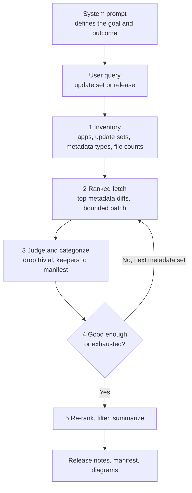

# [ALA](https://www.servicenow.com/docs/r/application-development/now-assist-for-creator/release-lifecycle-documentation-agent-landing.html)

# ServiceNow ALA: Release Lifecycle Documentation AI Agent

The **Release Lifecycle Documentation AI Agent** is an autonomous governance tool integrated into the ServiceNow platform under the **Application Lifecycle Analytics (ALA)** framework. Powered by the **Now Assist for Creator** suite, it automates one of the most tedious parts of DevOps: compiling exhaustive release notes, deployment manifests, and audit trails for application updates.

---

## 🧠 Agent Architecture: Built on the ReAct agentic framework

Both the ALA Release Documentation Agent and the App Summary Agent are built on the **ReAct (Reason → Act → Observe) agentic framework**, running an agentic RAG loop over tools rather than a single pipeline call. Each agent is initialized with a system prompt that defines its goal, receives the user's query, and then works it in a loop: reason about the current state, call the tool it needs next, observe the result, and repeat — continuing until the final outcome described by that system prompt is produced. The agent decides its own path through the tools based on what it finds.

Each documentation run follows the same closed loop:

1. **Inventory:** Scope the work first — fetch basic details like apps, update sets, metadata types, and file counts so the agent knows what it is working with before pulling diffs.
2. **Ranked fetch:** Pull diffs for the most important metadata types first, not everything at once, keeping each retrieval bounded.
3. **Judge and categorize:** Check that batch, drop trivial changes, categorize what remains, and fold the keepers into the running manifest.
4. **Loop:** Go back for the next set of metadata and repeat — until the summary is good enough or all content is processed.
5. **Re-rank, filter, summarize:** Re-rank everything collected, filter once more, then summarize into the final release notes, CAB deployment manifest, and architecture diagrams.

That reason → act → observe loop is what lets the agents handle arbitrary applications of any size: cheap scoping first, prioritized retrieval, per-batch judging, and a stop condition instead of a pre-baked prompt covering every case.

---

## 🚀 Core Capabilities

The agent automatically monitors and crawls scoped application changes, providing three primary automation benefits:

* **Automated Delta Code Analysis:** Instead of scanning a static application, the agent reviews the exact diffs, new code additions, script includes, and updated configurations packed into an update set or repository branch.
* **Human-Readable Release Notes:** Translates highly technical code updates, schema scripts, and system overrides into plain, business-friendly summaries detailing what was added, modified, or deleted.
* **Audit & Compliance Packaging:** Instantly aggregates change artifacts into a standardized deployment manifest required by corporate Change Advisory Boards (CAB), shortening hours of manual documentation down to a single click.

---

## 🏗️ Technical Pipeline & Alignment

The agent connects deeply across the ServiceNow application management ecosystem:

1. **Change Tracking:** Keeps a live baseline index of application states.
2. **Metadata Context:** References the [ServiceNow Supported Metadata Library](https://servicenow.com) to understand structural object edits.
3. **Pipeline Ingestion:** Feeds the generated Markdown change summary directly into deployment pipelines or governance gates within the **App Engine Management Center (AEMC)**.

---

## 🛠️ System Activation & Prerequisites

To leverage the **Release Lifecycle Documentation AI Agent** on your development instance, your platform must meet these criteria:

| Component | Requirement Specification |
| :--- | :--- |
| **Required Subscription** | Valid license for the **Now Assist for Creator** application suite. |
| **Core Plugin** | System installation of the `sn_now_assist_creator` application. |
| **Instance Activation** | The administrative console must have the [Now Assist panel turned on and configured](https://servicenow.com) for conversational chat interaction. |
| **Role Permissions** | Activating, tweaking, or embedding this agent into corporate pipeline gates requires the **`admin` system role**. |

---

## 🚶‍♂️ Access and Execution Flow

The release agent can be triggered directly within the administrative lifecycle environment:

1. Navigate to your application development instance.
2. Open the **Now Assist** conversational panel or access the app context inside your deployment dashboard.
3. Select the option to trigger the [Release Lifecycle Documentation AI Agent](https://servicenow.com) against your current scoped update.
4. Review, edit, or copy the compiled markdown document layout generated in real time.

# [App Summary AI Agent](https://www.servicenow.com/docs/r/application-development/now-assist-for-creator/sns-now-assist-app-summarize-landing.html)

# ServiceNow App Summary Agent: Overview & Core Capabilities

The **ServiceNow App Summary Agent** is an autonomous, Generative AI assistant built natively into the ServiceNow platform under the **Now Assist for Creator** application suite. It solves a universal developer and platform administrator problem: automatically analyzing, reverse-engineering, and documenting complex application architectures without requiring hours of manual code reviews.

---

## 🚀 Core Capabilities

Running on the same ReAct (reason → act → observe) agentic framework as the release agent, the App Summary Agent uses semantic discovery tools to crawl an entire scoped or global application metadata configuration, delivering three primary automated workflows:

* **Instant Architectural Descriptions:** Evaluates all active development components—including database tables, business rules, access control lists (ACLs), UI structures, and active workflows—and [automatically generates an application description](https://servicenow.com) that can be saved directly to the application registry.
* **Technical Manifest & Documentation Packaging:** Translates messy technical diffs, script inclusions, and metadata configurations into a beautifully structured Markdown document. This package includes comprehensive data profiling, code catalogs, and functional change overviews suitable for delivery to corporate change advisory boards (CAB).
* **Automated Architecture Diagramming:** Hooks cleanly into underlying system design utilities to map metadata references, visually rendering fully structured diagrams (such as **Mermaid.js scripts**) that depict exactly how data flows across different tables and integration points.

---

## 🏗️ Premium Variant: Release Lifecycle Documentation AI Agent (ALA)

When managing broader deployment pipelines, this meta-agent transitions into the **Application Lifecycle Analytics (ALA)** framework, operating specifically as a **Release Documentation AI Agent**:

* **Delta Change Identification:** Instead of summarizing the whole app, it crawls the delta changes between the current instance state and a pending update set or application repository branch.
* **Human-Readable Release Notes:** Translates cryptic code lines, raw script patches, and new dictionary configurations into an enterprise-ready, plain-language summary highlighting what features were modified, added, or deleted.

---

## 🛠️ Configuration and Security Requirements

To ensure stable operations and restrict administrative overview, the agent runs within a strict enterprise governance framework:

| Setup Component | Requirement Specification |
| :--- | :--- |
| **Required Entitlement** | Licensed and active **Now Assist for Creator** subscription bundle. |
| **Platform Plugin** | Must have the `sn_now_assist_creator` core plugin installed via the ServiceNow Store. |
| **Instance Activation** | The admin console must have the [Now Assist panel turned on and mapped](https://servicenow.com) for conversational chat interaction. |
| **Access Controls** | Tailoring, configuring, or modifying the prompt boundaries of this agent requires the explicit **`admin` system role**. |

---

## 🚶‍♂️ Access and Navigation Path

The agent can be invoked directly from your application composition studios:

1. Navigate to **All > App Engine > App Engine Studio (AES)** (or open standard ServiceNow Studio).
2. Launch the scoped or global application you wish to profile.
3. Locate and select the **Now Assist** or **Summarize App** button on the top-right header workspace layout.
4. The panel triggers the agent execution loop, displaying the text manifest configuration preview within seconds.
